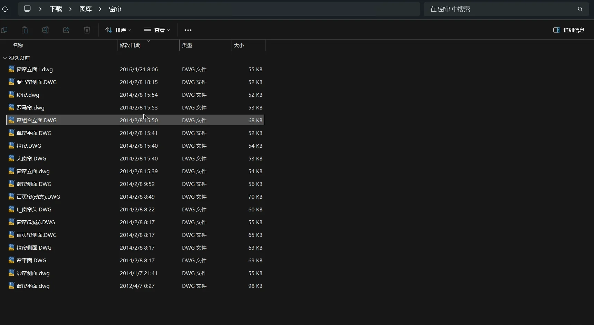

# QuickLook.Plugin.DwgsViewer

[](https://github.com/QL-Win/QuickLook)
[](https://dotnet.microsoft.com/)
[](LICENSE)

[English](#english) | [中文说明](#chinese)

<p align="center">
  
</p>

---

<a name="english"></a>
## English

A powerful, high-performance [QuickLook](https://github.com/QL-Win/QuickLook) plugin for AutoCAD, GstarCAD, and ZWCAD drawings (`.dwg` and `.dxf`).

Pressing <kbd>Spacebar</kbd> on any `.dwg` or `.dxf` file opens it instantly as a full-resolution vector drawing. If other drawings exist in the same folder, click <kbd>◀ 目录图纸</kbd> to browse them as a responsive thumbnail gallery with instant CAD block insertion, ranking, and search!

### ✨ Key Features

- **Instant Single-Drawing Preview**:
  - Opens the selected `.dwg` / `.dxf` directly in the full vector detail view — no extra clicks.
  - <kbd>◀ 目录图纸</kbd> returns to the folder gallery, and is automatically hidden when the folder holds only one drawing.
- **Folder-Wide Drawing Gallery**:
  - Automatically scans and lists all `.dwg` and `.dxf` drawings in the current folder.
  - Current drawing auto-scrolls into view.
- **Pure Black Canvas**:
  - Classic AutoCAD dark canvas by default, with one-key <kbd>B</kbd> toggle to light background.
- **Ultra-Fast Thumbnail Extraction**:
  - Directly extracts embedded binary preview bitmaps from DWG headers in $< 1\text{ms}$.
  - Seamless Windows Shell thumbnail fallback (`IShellItemImageFactory`) for `.dxf` and all CAD versions.
- **Insert into Running CAD (AutoCAD / GstarCAD / ZWCAD)**:
  - **Double-click** any drawing (or click `📥 插入到CAD`) to automatically insert it as a block into the currently active CAD document (`AutoCAD`, `浩辰CAD`, or `中望CAD`).
  - Automatically activates the CAD window and prompts for the insertion point!
- **Usage Frequency & Smart Ranking**:
  - Keeps track of insertion counts in the plugin directory (`config.json`).
  - Most frequently inserted drawings and folders automatically bubble to the top!
- **Favorites / Bookmarking**:
  - Click `⭐` to bookmark drawings; favorited drawings always stay pinned at the front!
- **Responsive Layout & Custom Columns**:
  - Custom column choices: 4, 5, 6, 8, or Auto-fit.
  - Paged lazy loading: opens the first 24 items instantly and auto-loads on scroll.
- **Zoom & Pan**:
  - Mouse wheel zoom centered at cursor position (10% to 3000%).
  - Left / Middle mouse drag to pan smoothly.
  - Double-click to reset to 100% Fit.
- **Fluent Search Box**:
  - Real-time search by filename with clear `✕` button.
- **Keyboard Shortcuts**:
  - <kbd>A</kbd> / <kbd>D</kbd> or <kbd>←</kbd> / <kbd>→</kbd>: Previous / Next drawing in detail view.
  - <kbd>I</kbd>: Insert current drawing into CAD.
  - <kbd>S</kbd>: Toggle favorite.
  - <kbd>B</kbd>: Toggle dark/light background.


### 🧩 Pluggable CAD Engine Architecture (`ICadEngine`)

This plugin features a zero-dependency, pluggable rendering engine architecture:
- **Default Open-Source Engine (100% Legal & Free)**:
  - Implements vector extraction and mathematical projection for the vast majority of common CAD entities:
    - Standard lines, arcs, circles, polylines with curved bulges (`bulge = tan(θ/4)`).
    - High-precision 3D vector cross-product elliptical arcs ($P(t) = \text{Center} + \cos(t) \cdot \mathbf{V}_{\text{major}} + \sin(t) \cdot (\mathbf{N} \times \mathbf{V}_{\text{major}}) \cdot \text{Ratio}$).
    - Multi-level recursive block references (`Insert` / `Block`) with full translation, rotation, and scaling matrices.
    - Dimension styles (linear, aligned, angular) with extension lines, solid arrowheads, and centered text.
    - Solids, Leaders, Splines, Polyline2D/3D, Hatch boundaries, and YaHei vector text layout.
  - Fast binary DWG header extraction ($< 0.3\text{ms}$) with Windows Shell integration.
- **Commercial Driver Hot-Plugging (For 100% Parity)**:
  - While our open-source engine covers most real-world engineering and furniture drawings, some hyper-complex drawings (e.g. proprietary 3D ACIS bodies, custom proxy objects) may not display completely.
  - **We have deliberately pre-built pluggable commercial driver interfaces (`ICadEngine`)**:
    1. **WoutWare CadLib Driver**: Place `WW.Cad.dll` and `WW.dll` in the plugin root or `Drivers/` folder for multi-threaded vector rendering.
    2. **CADSoftTools Driver**: Place `CADImport.dll` in the plugin root or `Drivers/` folder for CAD .NET vector rendering.
  - If present, the plugin automatically upgrades to the corresponding vector rendering pipeline with zero recompilation needed!
### 📦 Installation

#### Method 1: Spacebar One-Click Install (Recommended)
1. Download `QuickLook.Plugin.DwgsViewer.qlplugin` from [Releases](https://github.com/HexTTX/QuickLook.Plugin.DwgsViewer/releases).
2. Select the downloaded file in File Explorer and press <kbd>Spacebar</kbd>.
3. Click **Install** on the QuickLook prompt, then restart QuickLook.

#### Method 2: Manual Installation
Extract or copy the contents of `QuickLook.Plugin.DwgsViewer.qlplugin` (rename to `.zip` if needed) to:
```
%APPDATA%\pooi.moe\QuickLook\QuickLook.Plugin\QuickLook.Plugin.DwgsViewer\
```
Then restart QuickLook.

### 🔧 Optional: High-Fidelity Commercial Driver

The plugin works out of the box with its built-in open-source engine. To enable commercial-grade rendering, simply drop the driver DLLs into the folder above (or its `Drivers\` subfolder) — **no recompilation required**:

| Driver | Required files | Result |
|---|---|---|
| WoutWare CadLib | `WW.Cad.dll`, `WW.dll`, `WW.GL.dll`, `WW.License.dll` | Multi-threaded vector rendering |
| CADSoftTools | `CADImport.dll` | CAD .NET vector rendering |

The plugin probes for these drivers on startup and automatically upgrades when they are present.

### 🛠 Build from Source

```bash
cd QuickLook.Plugin.DwgsViewer
dotnet build -c Release
powershell -ExecutionPolicy Bypass -File pack.ps1
```

---

<a name="chinese"></a>
## 中文说明

为 Windows 效率神器 [QuickLook](https://github.com/QL-Win/QuickLook) 打造的 AutoCAD / 浩辰CAD / 中望CAD 图纸（`.dwg` 与 `.dxf`）全能预览与图库管理插件。

在文件资源管理器中选中任意一张 `.dwg` 或 `.dxf` 图纸按下 <kbd>空格键</kbd>，即可**直接秒开该图纸的满分辨率矢量大图**；若同目录下还有其他图纸，点击左上角 <kbd>◀ 目录图纸</kbd> 即可切换到现代化缩略图画廊，并支持一键插入至运行中的 CAD 软件！

### ✨ 核心特性

- **秒开单图大图预览**：
  - 空格触发即刻直接进入当前图纸的矢量大图详情视图，无需多余点击。
  - <kbd>◀ 目录图纸</kbd> 一键返回目录画廊；当同目录仅有一张图纸时，该按钮会**自动隐藏**，界面更清爽。
- **纯黑专业画布**：
  - 默认使用 AutoCAD 经典纯黑底色画布，按 <kbd>B</kbd> 一键切换深色 / 浅色主题。
- **目录级自动图纸检索**：
  - 点击 <kbd>◀ 目录图纸</kbd> 即自动扫描当前目录下的所有 `.dwg` 与 `.dxf` 文件，形成图库网格，当前图纸自动滚动定位。
- **毫秒级内嵌缩略图提取**：
  - 直接从 DWG 二进制文件头读取内置预览位图（耗时 $< 1\text{ms}$，无需启动庞大 CAD 引擎）。
  - 内置 Windows Shell 缩略图后备，完美支持各版本 AutoCAD、浩辰CAD、中望CAD 及 `.dxf` 文件。
- **双击一键插入正在运行的 CAD**：
  - 双击图纸（或在大图下点击 `📥 插入到CAD` 按钮 / 按 <kbd>I</kbd> 键），自动检测当前运行的 **AutoCAD、浩辰CAD（GstarCAD）或 中望CAD（ZWCAD）**。
  - 将当前图纸作为图块插入活动图纸文档，自动激活 CAD 窗口并提示用户点选放置点！
- **插入频次统计与智能排序**：
  - 在插件配置中自动记录图纸与目录的插入历史。
  - 插入次数越多的图纸，在画廊中**自动优先排在最前**，越用越聪明！
- **图纸收藏夹（置顶功能）**：
  - 点击卡片右上角 `⭐` 收藏图纸，收藏的图纸默认绝对置顶展示；顶部提供 `全部`、`⭐ 收藏`、`🔥 常用` 快速分类标签。
- **自定义列数与自适应网格**：
  - 顶部直接支持切换：`自动 / 4列 / 5列 / 6列 / 8列`，卡片等比例响应式伸缩。
  - 首屏秒开 + 滚动分页懒加载（首批载入 24 张，滚动按需追加）。
- **专业级交互支持**：
  - 滚轮以鼠标为中心平滑缩放，左键/中键拖拽平移，双击一键 100% 居中还原。
  - 按 <kbd>A</kbd> / <kbd>D</kbd> 左右切图，按 <kbd>B</kbd> 切换黑白底色，按鼠标侧键后退或双击返回网格。
  - Fluent 胶囊搜索框实时模糊过滤。


### 🧩 模块化可插拔渲染架构 (`ICadEngine`)

插件采用纯净开源、接口解耦的可插拔多引擎架构：
- **默认内置开源引擎（100% 纯净合规、自由免费）**：
  - 实现了绝大多数常见 CAD 图元的原生高精度几何与向量叉积投影：
    - 直线、圆弧、圆、多段线凸度圆角（`bulge = tan(θ/4)`，平滑拟合布料褶皱与曲面）。
    - 3D 向量叉积椭圆弧（$P(t) = \text{Center} + \cos(t) \cdot \mathbf{V}_{\text{major}} + \sin(t) \cdot (\mathbf{N} \times \mathbf{V}_{\text{major}}) \cdot \text{Ratio}$，彻底根除发散圆环）。
    - 多层嵌套图块引用（`Insert` / `Block`）的矩阵复合展开（平移、旋转、缩放）。
    - 尺寸标注（线性、对齐、角度标注，自动递归解包 `*D` 匿名图块、尺寸线、实心箭头与标准居中测量值）。
    - 实心体（`Solid` 箭头与填充）、引线（`Leader`）、样条曲线（`Spline`）、二维/三维多段线及图案填充边界。
    - 中英文矢量文字排版（支持对齐锚点映射与微软雅黑字体呈现）。
    - 0.3ms 极速 DWG 文件头官方预览提取与 Windows Shell 降级保底。
- **商业驱动预留接口（追求 100% 极致商业兼容）**：
  - 开源引擎虽已覆盖绝大多数常用工程设计与家具图纸，但对于极少部分极其特殊复杂的图纸（如三维 ACIS 实体、自定义代理实体等），若出现显示不全或要求 100% 商业级高保真还原：
  - **我们已专门预留了即插即用的商业驱动接口（`ICadEngine`）**：
    1. **WoutWare CadLib 驱动**：将 `WW.Cad.dll` 与 `WW.dll` 放置于插件目录或 `Drivers/` 文件夹，自动激活极速矢量渲染；
    2. **CADSoftTools 驱动**：将 `CADImport.dll` 放置于插件目录或 `Drivers/` 文件夹，自动激活 CAD .NET 矢量渲染与线程安全保护。
  - 插件启动时会自动检测并无缝切换至对应驱动引擎，满足不同用户在轻量合规开源与极致本地画质之间的个性化需求！
### 📦 安装方式

#### 方式一：空格键一键安装（推荐）
1. 在 [Releases](https://github.com/HexTTX/QuickLook.Plugin.DwgsViewer/releases) 页面下载 `QuickLook.Plugin.DwgsViewer.qlplugin`；
2. 选中下载的 `.qlplugin` 文件，按下 <kbd>空格键</kbd>；
3. 点击弹出窗口中的 **Install** 按钮，重启 QuickLook 即可生效。

#### 方式二：手动安装
将 `QuickLook.Plugin.DwgsViewer.qlplugin`（必要时重命名为 `.zip`）解压或复制全部内容到：
```
%APPDATA%\pooi.moe\QuickLook\QuickLook.Plugin\QuickLook.Plugin.DwgsViewer\
```
然后重启 QuickLook 即可生效。

### 🔧 可选：启用高保真商业驱动

插件开箱即用（内置纯开源引擎）。如需启用商业级渲染，只需把对应驱动 DLL 放入上述插件目录（或其 `Drivers\` 子文件夹）即可，**无需重新编译**：

| 驱动 | 所需文件 | 效果 |
|---|---|---|
| WoutWare CadLib | `WW.Cad.dll`、`WW.dll`、`WW.GL.dll`、`WW.License.dll` | 纯实例多线程矢量渲染 |
| CADSoftTools | `CADImport.dll` | CAD .NET 矢量渲染 |

插件启动时会自动探测这些驱动，检测到后立即无缝升级渲染管线。

### 🛠 从源码构建

```bash
cd QuickLook.Plugin.DwgsViewer
dotnet build -c Release
powershell -ExecutionPolicy Bypass -File pack.ps1
```

---

## 📄 License

MIT License
